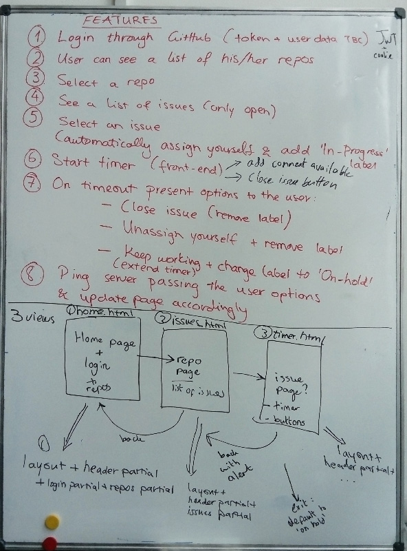

# Gitpom

## Brief description
A pomodoro timer which integrates with GitHub issues for mad efficiency and cool stuff.

# Instructions

## UX main features   

- user goes to homepage and logins (GitHub OAuth)
- user can see a list of his/her repos
- user selects a repo and can see all open related issues     
- user selects an issue and can see more details on it
- user can start the pomodoro timer on a selected issue (automatically gets assigned and a label 'in-progress' is added)
- user can close the issue at any time before timeout and/or add a comment (two separate buttons/inputs)
- Timer counts down
- On timeout the user can:   
    - close the issue ('in-progress' label removed)
    - abandon the issue (unassign yourself and label removed)
    - keep working (i.e. extend the timer and label changed to 'on-hold')
- user is redirected to homepage when closing or abandoning an issue; else they stay on the pomodoro page

## Technical features
#### Project folder structure
- .gitignore
- config.env
- public
  - css
  - js
- src
  - routes
    - index.js
  - lib
  - server.js
- views
  - layout
    - default.html
  - partials
    - header.html
    - timer.html
    - login.html
    - repos.html
    - user_options.html
  - home.html
  - issues.html
  - pomodoro.html
- tests
  - tape
    - tape-tests.js

#### Goals
- Server setup using Hapi
- Pages will be setup using handlebars (i.e a layout, views and partials)
- Github token to be put in a JWT (no storage in a server database for now)
- Pomodoro timer to run in the front-end and functionality to be added to the timer partial from the client-side
